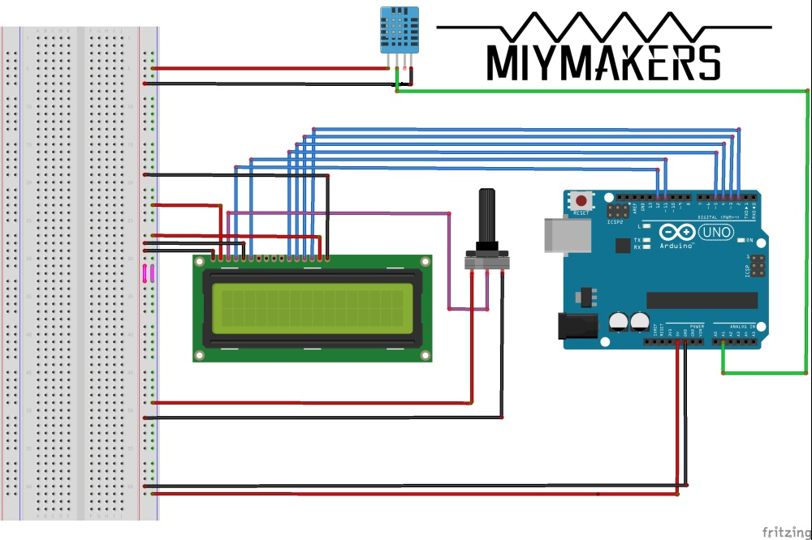

<h1 align="center"> Arduino Weather Station</h1>
<h2 align="center">This is an Arduino Weather Station Program.</h2>

In this program,you can use your Arduino Uno Rev3 and DHT Tempture sensor with 1602A LCD monitor to make a weather station easily.This source come from https://miymakers.wordpress.com/ and in this course of study I find some wrong and fixed in this page.

This station will use 5V port on Arduino.

<h3 align="center">Connect</h3>
<h4 align="center">LCD Connect</h4>

D7- DIGITAL PIN 2 D6 – 3 D5 – 4 D4 – 5 E – 11 RS – 12 VDD (+) RAIL BREADBOARD A (+)RAIL BREADBOARD VSS (-)RAIL BREADBOARD K (-)RAIL BREADBOARD RW (-)RAIL BREADBOARD VO –  Potentiometer Middle Pin

<h4 align="center">DHT sensor Connect</h4>

We will be perforated positive side and left to right a total of 4 pins(may be your only have 3 pins but that is better). The first pin is VCC,can work on 3.3V to 5.5V The second pin is DATA PIN,you need connect this pin to A1 port on board. The third pin is empty (3 pins DHT sensor don't have this pin) The fourth pin is GND Caution!You need use this pin and in the orginal course of study,they teach you use third pin and that is WRONG!

<h3 align="center">Flash the sourse to board</h3>

And now,you need install DHT repo to your Arduino IDE,you can see a zip package named DHT.zip in this repo.Caution!You must install this package and if you don't install this you may be get so many errors 

<h3 align="center">congratulation!Now you can see Temp and Humidity data in your 1602A monitor throught adjustment potentiometer if you connect right!</h3>
 
<h2 align="center">这是一个构建 Arduino 气象站的小项目</h2>

    你可以通过这个项目轻松地使用你的 Arduino Uno 和 DHT 温湿度传感器以及 1602A 点阵屏来构建一个小的 Arduino 气象站.本项目的源码来自 https://miymakers.wordpress.com/ 在这个原来的教程中出现了一个小错误，我会在后面的教程中纠正它

此气象站将使用 5V 供电.

<h3 align="center">接线</h3>
<h4 align="center">LCD 显示屏的连接</h4>

D7 - 2 号接口 D6 – 3 号接口 D5 – 4 号接口 D4 – 5 号接口 E – 11 号接口 RS – 12 号接口 VDD 接入电源正极 A 接入电源正极 VSS 接入电源负极 K 接入电源负极 RW 接入电源负极 VO –  电位器的中间脚

<h4 align="center">DHT 传感器的连接</h4>

我们以有很多孔的一面为正面，从左到右一共有4个引脚（如果你的只有三个引脚那更好）. 第一个引脚接电源正极，工作电压范围是 3.3V 到 5.5V 第二个引脚是输出脚，你需要把它连接到 A1 接口 第三个脚是空置脚（如果你的 DHT 只有三个脚则你的传感器上没有这个脚） 第四个脚接电源负极 注意，原始的教程上让你把第三个脚接到 A1 接口上，这是错误的

<h3 align="center">烧写源码</h3>

现在，你需要在你的 Arduino IDE 中安装本库中的 DHT.zip 到你的库中.注意，你必须安装这个库，否则你会在编译过程中出现错误

<h3 align="center">恭喜！如果你接线没问题的话，现在已经可以通过调整电位器看见屏幕上显示出数据了！</h3>

<h2 aligh="center">This is connect picture / 接线图示</h2>

